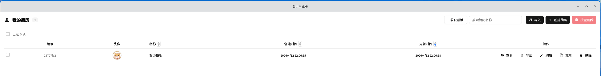
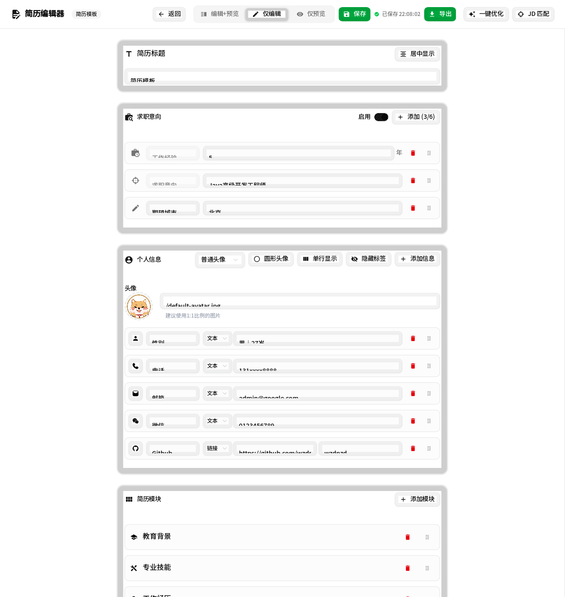
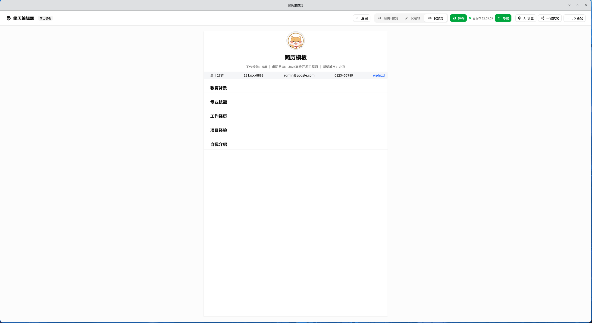
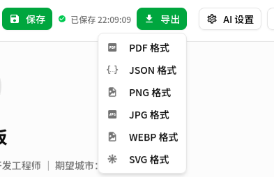
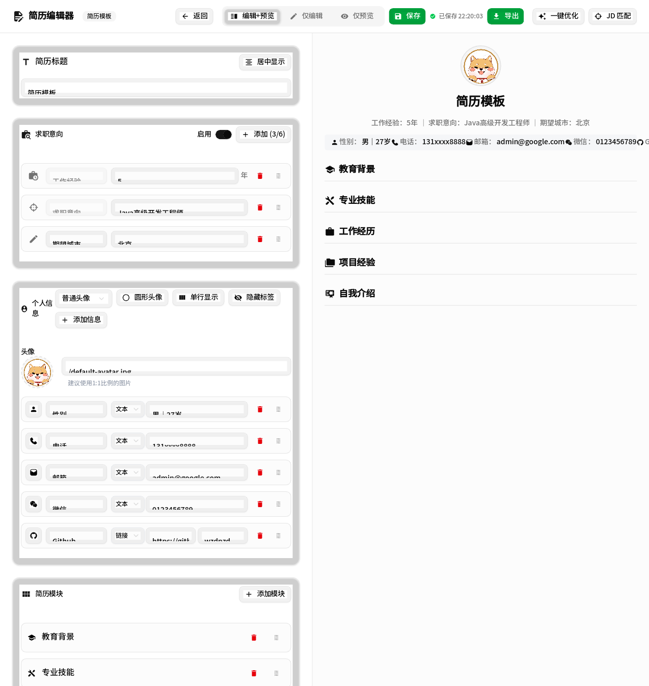

# 简历生成器

> ⭐⭐⭐ **如果这个项目对您有帮助，请给个小星星！** 您的支持是我持续改进和添加新功能的动力。

一个基于 **Tauri v2 + Vite + React** 的桌面简历编辑器。你可以在本地创建、编辑、预览、导出和管理多份简历，支持 PDF、PNG、JPG、WEBP、SVG、JSON 等多种导出格式，并集成了可配置的 AI 简历优化能力。

## 功能特点

- **多份简历管理**：首页集中管理你的简历，支持搜索、排序、批量删除、导入和导出
- **桌面本地存储**：简历数据保存在 Tauri 应用数据目录中，而不是浏览器 `localStorage`
- **模块化编辑**：支持添加、删除、重排简历模块，适配教育、工作、项目等内容
- **实时预览**：编辑与预览联动，所见即所得
- **桌面 PDF 导出**：由 Rust + `headless_chrome` 生成 PDF，并支持保存到用户指定位置
- **图片导出**：支持 PNG、JPG、WEBP、SVG 导出
- **JSON 导入导出**：便于备份、迁移和模板复用
- **AI 能力**：支持 AI 配置、岗位 JD 分析、简历润色与整份简历优化
- **富文本支持**：支持文本样式、颜色、对齐、链接、标签等丰富编辑能力

## 页面示例截图

1. 用户中心：本地集中管理多份简历  
   

2. 编辑和预览：边编辑边查看渲染效果  
   

3. 仅编辑：专注于内容编写  
   

4. 仅预览：查看最终展示效果  
   

5. 自由布局：支持多种布局和模块组合  
   

6. 多种导出方式：不同成品满足不同投递需求  
   

7. 标签功能：快速表达项目、技能或亮点  
   

## 技术栈

- **桌面框架**：Tauri v2
- **前端构建**：Vite 6
- **前端框架**：React 19 + React Router 7
- **语言**：TypeScript + Rust
- **UI 组件**：Shadcn UI
- **样式**：Tailwind CSS v4
- **富文本**：Tiptap 3
- **拖拽**：@hello-pangea/dnd
- **PDF 生成**：Rust + `headless_chrome`
- **图标**：Iconify

## 快速开始

### 安装依赖

```bash
pnpm install
```

### 前端开发模式

```bash
pnpm dev
```

默认启动 Vite 开发服务器，地址为 `http://localhost:5173`。

### Tauri 桌面开发模式

```bash
pnpm tauri:dev
```

该命令会先启动前端开发服务器，再拉起 Tauri 桌面窗口。

### 构建前端产物

```bash
pnpm build
```

### 构建桌面应用

```bash
pnpm tauri:build
```

## 项目结构

```text
/
├── components/                 # React 组件（编辑器、预览、导出、AI 功能、UI 组件等）
├── hooks/                      # React hooks
├── lib/                        # 前端工具与 Tauri 调用封装
├── public/                     # 静态资源、模板 JSON、字体等
├── src/
│   ├── App.tsx                 # 路由与 Provider 入口
│   ├── main.tsx                # Vite React 启动入口
│   └── routes/                 # 页面路由：Home / Edit / View / Print
├── src-tauri/
│   ├── capabilities/           # Tauri 能力权限声明
│   ├── src/
│   │   ├── ai_config.rs        # AI 配置读写
│   │   ├── lib.rs              # Tauri 插件和命令注册入口
│   │   ├── pdf.rs              # PDF 生成
│   │   ├── resume.rs           # 简历数据校验与辅助构造
│   │   └── storage.rs          # 简历本地存储
│   ├── tauri.conf.json         # Tauri 配置
│   └── Cargo.toml              # Rust 依赖
├── styles/                     # 全局样式、打印样式、Tiptap 样式
├── types/                      # TypeScript 类型定义
├── AGENTS.md                   # 项目代理开发说明
└── README.md
```

## 路由说明

当前桌面应用使用 React Router：

- `/`：简历列表 / 用户中心
- `/edit/new`：创建新简历
- `/edit/:id`：编辑已有简历
- `/view/:id`：只读预览
- `/print`：打印渲染页面

## 数据与存储

- 前端通过 `lib/storage.ts` 调用 `@tauri-apps/api/core` 的 `invoke(...)`
- Rust 侧在 `src-tauri/src/storage.rs` 中处理简历读写
- 简历数据存储在 Tauri 应用数据目录中的 `resumes.json`
- 项目保留了旧格式数据兼容/迁移逻辑

这意味着当前版本的“本地存储”是 **桌面本地文件存储**，而不是浏览器 `localStorage`。

## PDF / 图片 / JSON 导出

### PDF 导出

- 前端生成用于打印的 HTML 内容
- Rust 命令 `generate_pdf` 调用 `headless_chrome` 渲染 HTML
- 生成后的 PDF 会先写入应用数据目录，再由前端复制到用户选择的位置
- 保存流程依赖 Tauri 的 `dialog` 和 `fs` 能力

### 图片导出

- 使用 `html-to-image` 生成 PNG / JPG / WEBP / SVG
- 导出前会准备离屏预览节点，避免依赖页面当前布局状态

### JSON 导入导出

- 可将简历内容导出为 JSON 进行备份
- 可重新导入 JSON 恢复或迁移简历内容

## AI 功能

当前仓库已经包含桌面端 AI 能力相关模块，主要包括：

- AI 服务配置
- JD 分析
- 简历润色
- 整份简历优化

相关代码可重点查看：

- `components/ai-settings-dialog.tsx`
- `components/jd-analysis-sheet.tsx`
- `components/full-resume-optimization-dialog.tsx`
- `lib/ai-config.ts`
- `lib/ai-service.ts`
- `types/ai.ts`
- `src-tauri/src/ai_config.rs`

## 关键开发命令

```bash
pnpm install
pnpm dev
pnpm build
pnpm tauri:dev
pnpm tauri:build
```

## 开发注意事项

- 请始终使用 `pnpm`
- 这是 **Vite + React Router** 项目，不要重新引入 Next.js 目录结构或约定
- 不要添加 Next.js 专属的 `"use client"` 指令
- 需要修改数据持久化时，应优先更新 `lib/storage.ts` 与 Rust 后端命令，而不是直接在 UI 里处理底层存储
- 修改桌面文件操作逻辑时，要同步检查 `src-tauri/capabilities/default.json`
- PDF 功能依赖 `headless_chrome`，不同机器上的 Chrome/Chromium 可用性可能影响运行表现

## 后续可继续完善的方向

- 提升 PDF 失败时的错误提示与降级体验
- 进一步统一主题持久化与其它桌面端状态管理策略
- 补充 Windows / macOS / Linux 的打包验证
- 增加更多简历模板与 AI 场景

## 许可证

MIT
